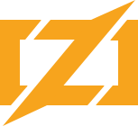

<!-- PROJECT SHIELDS -->
<!--
*** I'm using markdown "reference style" links for readability.
*** Reference links are enclosed in brackets [ ] instead of parentheses ( ).
*** See the bottom of this document for the declaration of the reference variables
*** for contributors-url, forks-url, etc. This is an optional, concise syntax you may use.
*** https://www.markdownguide.org/basic-syntax/#reference-style-links
-->
<div align="left">

[![Contributors][contributors-shield]][contributors-url]
[![Forks][forks-shield]][forks-url]
[![Stargazers][stars-shield]][stars-url]

</div>

<a href="https://github.com/Kaweees/modern-zig">
  
</a>

<div align="left">
  <h1><em><a href="https://github.com/Kaweees/modern-zig">~modern-zig</a></em></h1>
</div>

<!-- ABOUT THE PROJECT -->

A three-dimensional header-only graphics library written in C++13 and accelerated with CUDA/Apple Metal.

### Built With

[![Zig][Zig-shield]][Zig-url]
[![NixOS][NixOS-shield]][NixOS-url]
[![GitHub Actions][github-actions-shield]][github-actions-url]

<!-- PROJECT PREVIEW -->
## Preview

<p align="center">
  
</p>

<!-- GETTING STARTED -->
## Getting Started

### Prerequisites

Before attempting to build this project, make sure you have [Nix](https://nixos.org/download.html) with [Flake](https://nixos.wiki/wiki/Flakes) support installed on your machine.

Additionally, if you wish to utilize the GPU acceleration features, you will need to have [CUDA Toolkit](https://developer.nvidia.com/cuda-downloads) or [Apple Metal](https://developer.apple.com/metal/cpp/) installed on your machine.

### Installation

To get a local copy of the project up and running on your machine, follow these simple steps:

1. Clone the project repository

   ```sh
   git clone https://github.com/Kaweees/modern-zig.git
   cd modern-zig
   ```

2. Install the project dependencies

   ```sh
   nix-shell --max-jobs $(nproc) # Linux / Windows (WSL)
   nix-shell --max-jobs $(sysctl -n hw.ncpu) # macOS
   ```

3. Build the project

   ```sh
   just build
   ```

4. Run the project

   ```sh
   just run <package_name>
   ```

## Usage

kiwiGL is designed to be easy to use. You can include the library in your C++ project by adding the following line to your source files:

```cpp
#include <kiwigl/kiwigl.h>
```

### Benchmarks

kiwiGL is capable of rendering 3D scenes with thousands of triangles at interactive frame rates. The following benchmarks were conducted on a 2019 MacBook Pro with a 2.3 GHz 8-Core Intel Core i9 processor and 16 GB of RAM.

| Benchmark | Description | Result |
| --------- | ----------- | ------ |
| `cube` | Render a cube with 12 triangles | 60 FPS |
| `sphere` | Render a sphere with 960 triangles | 60 FPS |
| `bunny` | Render a Stanford Bunny with 69451 triangles | 60 FPS |
| `dragon` | Render a Stanford Dragon with 871306 triangles | 60 FPS |

### Conventions

kiwiGL uses the following conventions:

- [left-handed coordinate system](https://www.scratchapixel.com/lessons/mathematics-physics-for-computer-graphics/geometry/coordinate-systems.html#:~:text=The%20differentiation%20between%20left%2Dhanded,a%20right%2Dhand%20coordinate%20system)
- [counter-clockwise winding order](https://learnwebgl.brown37.net/model_data/model_volume.html#:~:text=Winding%20Order%20for%20a%20triangle,the%20front%20of%20the%20triangle.) for triangle vertices

### Keyboard Controls

kiwiGL uses the following keyboard shortcuts:

| Command Keybind | Command Description |
| --------------- | ------------------- |
| <kbd>CTRL</kbd> + <kbd>q</kbd> | Quit the application |

<!-- PROJECT FILE STRUCTURE -->
## Project Structure

```sh
kiwiGL/
├── .github/                       # GitHub Actions CI/CD workflows
├── include/                       # project header files
│   └── kiwiGL/                      # Header files for the kiwiGL library
├── src/                           # project source files
│   └── ...                          # Entry point, main function
├── CMakeLists.txt                 # CMake build script
├── LICENSE                        # project license
└── README.md                      # you are here
```

## License

The source code for [Kaweees/modern-zig](https://github.com/Kaweees/modern-zig) is distributed under the terms of the GNU General Public License v3.0, as I firmly believe that collaborating on free and open-source software fosters innovations that mutually and equitably beneficial to both collaborators and users alike. See [`LICENSE`](./LICENSE) for details and more information.

<!-- MARKDOWN LINKS & IMAGES -->
<!-- https://www.markdownguide.org/basic-syntax/#reference-style-links -->

[contributors-shield]: https://img.shields.io/github/contributors/Kaweees/modern-zig.svg?style=for-the-badge
[contributors-url]: https://github.com/Kaweees/modern-zig/graphs/contributors
[forks-shield]: https://img.shields.io/github/forks/Kaweees/modern-zig.svg?style=for-the-badge
[forks-url]: https://github.com/Kaweees/modern-zig/network/members
[stars-shield]: https://img.shields.io/github/stars/Kaweees/modern-zig.svg?style=for-the-badge
[stars-url]: https://github.com/Kaweees/modern-zig/stargazers

<!-- MARKDOWN SHIELD BAGDES & LINKS -->
<!-- https://github.com/Ileriayo/markdown-badges -->
[Zig-shield]: https://img.shields.io/badge/Zig-%f7a41d.svg?style=for-the-badge&logo=zig&logoColor=f7a41d&labelColor=222222&color=f7a41d
[NixOS-shield]: https://img.shields.io/badge/NIX-%23008080.svg?style=for-the-badge&logo=NixOS&logoColor=5277C3&labelColor=222222&color=5277C3
[NixOS-url]: https://nixos.org/
[Zig-url]: https://ziglang.org/
[github-actions-shield]: https://img.shields.io/badge/github%20actions-%232671E5.svg?style=for-the-badge&logo=githubactions&logoColor=2671E5&labelColor=222222&color=2671E5
[github-actions-url]: https://github.com/features/actions
